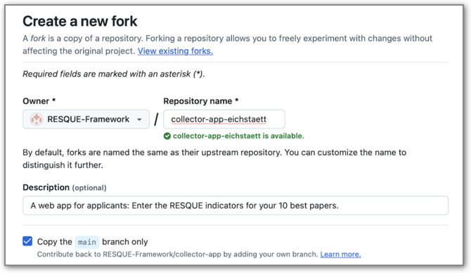
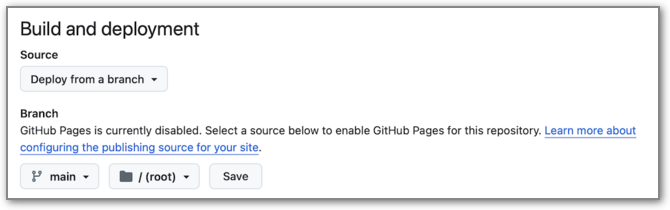
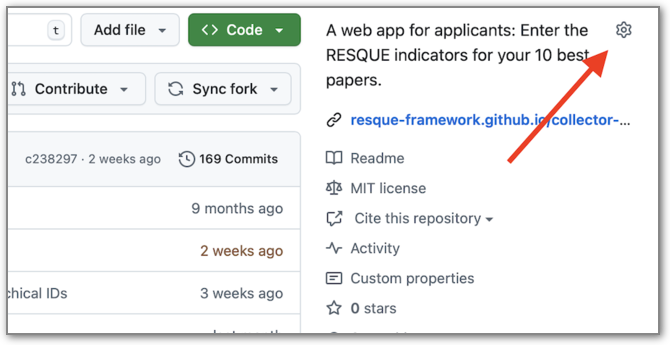
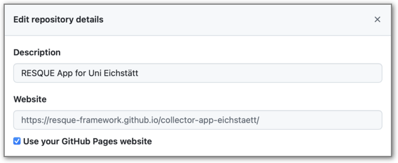
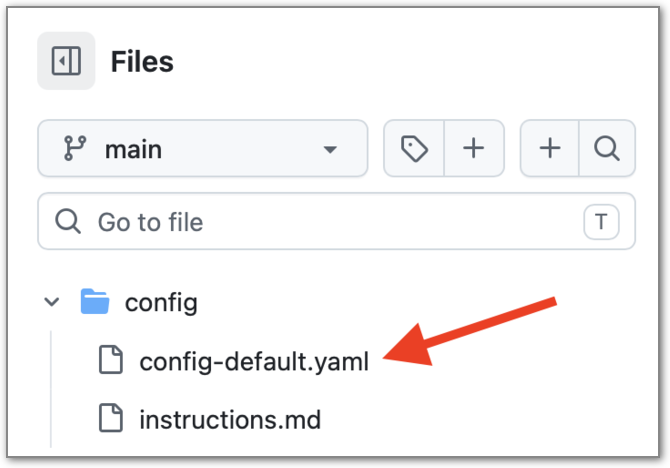
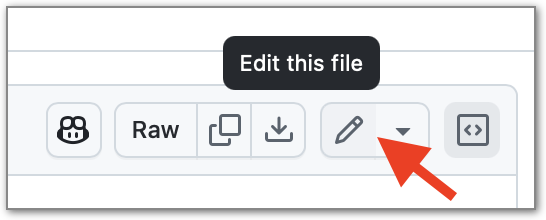
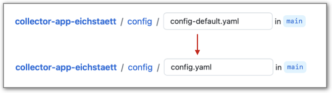
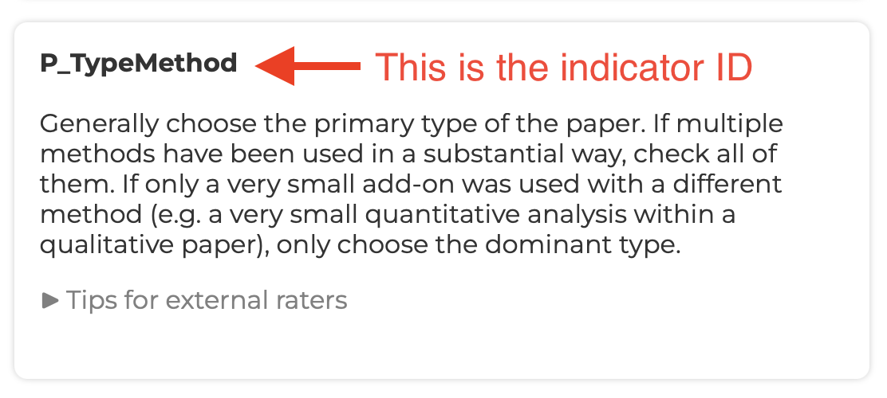

# How to create a customized copy ("fork") of the RESQUE Collector App

We assume the following:

- You have a GitHub account
- You have a basic understanding of Git (although, if you follow the instructions below closely, you don't need to use Git directly)

In most cases, you only need to change one file (`config/config.yaml`) for your customization. This can easily be done on the Github website itself; hence it is not necessary to clone a local copy of the repository.

## Step 1: Fork the Collector App repository

1. Go to the [Collector App repository](https://github.com/RESQUE-Framework/collector-app)
2. Click on the "Fork" button in the top right corner of the page
3. Select your GitHub account as the destination for the fork

In the example, we used the GitHub organization `RESQUE-Framework` account to fork the Collector App repository. Choose a meaningful repository name for your fork, e.g., `collector-app-MYUNIVERSITY`. I chose the version for Uni Eichstätt as an example:



Select "Copy the `main` branch only".

## Step 2: Enable GitHub Pages

In order to have a working website, you need to enable GitHub Pages for your fork.

1. Go to the *:gear: Settings* of your forked repository, and then on the left menu to *Pages*.
2. Select "Deploy from a branch", choose the `main` branch and select :file_folder: / (root). Click on the "Save" button:



3. In the main tab menu, go back to the main page of your forked repository ("Code").
4. On the top right, click on the Gear icon to access the settings of your repository.



5. Add a description. Select "Use your GitHub Pages website" (do not enter anything in the Website field; it will get disabled as soon as you click "Use your GitHub Pages website"). Click "Save changes".



6. Go back to the main page of your repository and click on the link to your GitHub Pages website (below the gear on the right side). It should look like this: `https://<your-github-username>.github.io/collector-app-MYUNIVERSITY/`.

> :bulb: **This is the link you will distribute to your applicants.**


## Step 3: Customize the Collector App

**1. In the main menu, go to the *Code* tab**, click on the `config` folder (this brings you to another view of all files), and then click in the left file tree on the file `config/config-default.yaml`.



**2. Click on the pencil icon (top right) to edit the file**



**3. First, on the top of the window, change the name of the file to `config.yaml`** (without the default):



**4. Make adjustments:**
   1. Change `main_title: "RESQUE"` to `main_title: "RESQUE MYUNIVERSITY"`. 
   2. Change `image_url` to an link towards your university's logo (the image is automatically shrunken to the correct size)
   3. Change `background_color: "#ffffff"`. This makes your app visually distinguishable from the generic Collector App.
   4. Change `show_instruction: false` to `true`. Then the welcome text (defined in `config/instructions.md`, see below) will be shown to the applicants.
   5. You can change `show_beta_warning` to `false` to hide the message about this software being in beta stage in the top left box.
   6. Set `committee_limits` to `true` if `min` and `max` (see below) should be enforced by the app.
   7. You can change `min: 5` to the minimum number of publications that your applicants must enter.
   8. You can change `max: 10` to the maximum number of publications that your committee expects. Candidates can enter more publications in the app, but are asked to export only `max` publications for their submission to the committee. They can also enter less than `max` papers (but at least `min` papers).
   9. You can change `maxTopPapers: 3` to how many papers can (and must) be selected as "best papers".
   


**5. Click on the green "Commit changes..." button at the top right of the page.** 

In the pop-up window, you can add a description of the changes you made (or just keep the default commit message) and click "Commit changes". Then the changes are saved to your repository.

> :bulb: Any changes will take a few minutes after a commit until they are visible online under your custom link. Furthermore, you have to do a **reload** in your browser to see the changes, as Github uses caching. Maybe you even have to **clear your browser cache** to see the changes.
 
> :bulb: Of course, if you know git, you can clone the repository to your local machine and make the changes there. Then you can push the changes to your forked repository.


**6. In the same way, edit the file `config/instructions.md`.** 

Change the text to fit the requirements of your university. The text must be in Markdown format. You can use the [Markdown Cheatsheet](https://www.markdownguide.org/cheat-sheet/) for help.

**7. Optional: Edit the file `packs/core-meta.json`.** 

Search for "AcademicAgeBonus" and change the content of the field `"title"`. Define which life circumstances are valid to count towards a reduction of academic age (e.g.: "We consider the following life circumstances as valid for a reduction of academic age: Parental leave, long-term illness, refugee or migrant status-related interruptions, and natural disasters or geopolitical events.").

> :bulb: `.json` files are in a specific format. Make sure you don't break the format when editing them. You can use an [online json validator](https://jsonlint.com) to check your changes. A common error is that json does not support line breaks within a string. If you want to have a line break, you can use `<br>` (e.g., `"We consider the following life circumstances as valid for a reduction of academic age:<br>Parental leave, long-term illness [...]"`).

**8. Optional: Change the set of indicators**

The `sources` field in `config.yaml` defines which sets of indicators are included. Here is the default set for publications ("pubs"):

```yaml
pubs:
  active: true
  sources: ["packs/core-pubs.json"]
  exclude: []
```

If you want to add an expansion pack, e.g. the Clinical Expansion pack, provide the link to the pack:

```yaml
sources: ["packs/core-pubs.json", "packs/EP/EP-clinical_psychology.json"]
```

The indicators are displayed in the order provided here (i.e., the expansion pack will be displayed after the default pack).

By default all indicators defined in the packs are shown. You can exclude specific indicators by providing their IDs in the `exclude` array, for example:

```yaml
exclude: ["P_IndependentVerification", "P_ImpactStatement_Info", "P_ImpactStatement"]
```

You can find the ID of each indicator in the packs themselves (e.g., see file `packs/core-pubs.json`), or when you go to the website of your app, click on any indicator in the middle pane, and inspect the help section in the right pane:



> :bulb: The generated report relies on the existence of some indicators - whenever you exclude an indicator, this bears the risk of breaking the report generation. If in doubt, you can consult the team which indicators are essential for the report and which not.


## Step 4: Test your customized app

After you commited all changes, the app is ready for testing. You can use the link to your GitHub Pages website to test the app (see "Step 2" above).

Before you distribute the link to your applicants, you should test the app yourself. Enter some test data and export it. Check if you can [generate the profile](https://shiny.psy.lmu.de/felix/RESQUE_profile/) (see also next step).


## Step 5: Generate the applicants' profiles

The profiles are computed with the [RESQUER](https://resque-framework.github.io/RESQUER/) R package.
It provides both an individual profile (see `RESQUE_profile.qmd`) and a comparative overview of multiple applicants (see `RESQUE_overview.qmd`)

You can either create the profiles locally on your machine: Install the RESQUER package and follow the [instructions](https://resque-framework.github.io/RESQUER/).

Or you use the [Profile Builder app](https://shiny.psy.lmu.de/felix/RESQUE_profile/). In this case the profile is built on an LMU server and provided for download. No data is stored permanently on the server, but for a few seconds there is a temporary copy of the uploaded json file. Consider relevant privacy regulations before using that app.

## Advanced considerations

- You want your app to be stable while applicants enter their data. Therefore, you should not change the `main` branch of your Collector App fork after data collection started (or at least really know what you are doing). Furthermore, **do not sync your fork with the original repository** (i.e., pulling changes from the general RESQUE Collector app into your fork) - we might make breaking changes there, which can disrupt your data collection.
