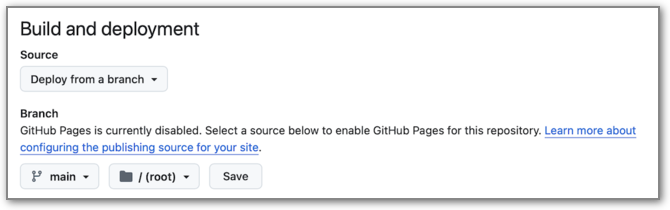

# How to create a customized copy ("fork") of the RESQUE Collector App

We assume the following:

- You have a GitHub account
- You have a basic understanding of Git (although, if you follow the instructions below closely, you don't need to use Git directly)

## Step 1: Fork the Collector App repository

1. Go to the [Collector App repository](https://github.com/RESQUE-Framework/collector-app)
2. Click on the "Fork" button in the top right corner of the page
3. Select your GitHub account as the destination for the fork

In the example, we used the GitHub organization `RESQUE-Framework` account to fork the Collector App repository. Choose a meaningful repository name for your fork, e.g., `collector-app-MYUNIVERSITY`. I chose the version for Uni Eichstätt as an example:

Select "Copy the `main` branch only".

## Step 2: Enable GitHub Pages

In order to have a working website, you need to enable GitHub Pages for your fork.

1. Go to the *:gear: Settings* of your forked repository, and then on the left menu to *Pages*.
2. Select "Deploy from a branch", choose the `main` branch and select :file_folder: / (root). Click on the "Save" button:

3. In the main tab menu, go back to the main page of your forked repository ("Code").
4. On the top right, click on the Gear icon to access the settings of your repository.

5. Add a description. Select "Use your GitHub Pages website" (do not enter anything in the Website field; it will get disabled as soon as you click "Use your GitHub Pages website"). Click "Save changes".

6. Go back to the main page of your repository and click on the link to your GitHub Pages website (below the gear on the right side). It should look like this: `https://<your-github-username>.github.io/collector-app-MYUNIVERSITY/`.

> :bulb: **This is the link you will distribute to your applicants.**

## Step 3: Customize the Collector App

1. In the main menu, go to the *Code* tab, click on the `config` folder (this brings you to another view of all files), and then in the left file tree on the file `config/config.yaml`.
2. Click on the pencil icon (top right) to edit the file

3. Make adjustments in `config/config.yaml`:
   1. Change `main_title: "RESQUE"` to `main_title: "RESQUE MYUNIVERSITY"`. 
   2. Change `background_color: "#ffffff"`. This makes your app visually distinguishable from the generic Collector App.
   3. Change `show_instruction: false` to `true`. Then the welcome text (defined in `config/instructions.md`, see below) will be shown to the applicants.
   4. You can change `max: 10` to the maximum number of publications that your committee expects. Candidates can enter more publications, but are asked to export only `max` publications for their submission to the committee.
   5. You can change `maxTopPapers: 3` to how many papers can (and mnust) be selected as "best papers".
   6. You can change `show_beta_warning` to `false` to hide the message in the top left box.

4. Click on the green "Commit changes..." button at the top right of the page. In the pop-up window, you can add a description of the changes you made (or just keep the default commit message) and click "Commit changes". Then the changes are saved to your repository.

> :bulb: Of course, if you know git, you can clone the repository to your local machine and make the changes there. Then you can push the changes to your forked repository.

5. In the same way, edit the file `config/instructions.md`. Change the text to fit the requirements of your university. The text must be in Markdown format. You can use the [Markdown Cheatsheet](https://www.markdownguide.org/cheat-sheet/) for help.

6. Edit the file `packs/core-meta.json`. Search for "AcademicAgeBonus" and change the content of the field `"title"`. Define which life circumstances are valid to count towards a reduction of academic age (e.g.: "We consider the following life circumstances as valid for a reduction of academic age: Parental leave, long-term illness, refugee or migrant status-related interruptions, and natural disasters or geopolitical events.").

> :bulb: `.json` files are in a specific format. Make sure you don't break the format when editing them. You can use an [online json validator](https://jsonlint.com) to check your changes. A common error is that json does not support line breaks within a string. If you want to have a line break, you can use ` ` (e.g., `"We consider the following life circumstances as valid for a reduction of academic age: Parental leave, long-term illness [...]"`).

7. The indicators are defined in `packs/core-pubs.json`. You can edit this json file to change the indicators that are shown to the applicants. You can change the wording of indicators, add new indicators, or remove existing ones.
   1. You can change the wording, but do not change the `id` of an indicator - this would break the creation of the applicant's profile.
   2. Also, deleting some of the "core indicators" might break the profile creation.

> :bulb: Any changes will take a few minutes until they are visible online under your custom link. Furthermore, you have to do a **reload** in your browser to see the changes, as Github uses caching. Maybe you even have to **clear your browser cache** to see the changes.

## Step 4: Adjust the computation applicants' profile

TBD - just a few notes:

- The profiles are computed with the [RESQUER](https://resque-framework.github.io/RESQUER/) R package.
- It provides both an individual profile (see `RESQUE_profile.qmd`) and a comparative overview of multiple applicants (see `RESQUE_overview.qmd`)

## Advanced considerations

- You want your app to be stable while applicants enter their data. Therefore, you should not change the `main` branch of your Collector App fork after data collection started. Furthermore, **do not sync your fork with the original repository** (i.e., pulling changes from the general RESQUE Collector app into your fork) - we might make breaking changes there, which can disrupt your data collection.
